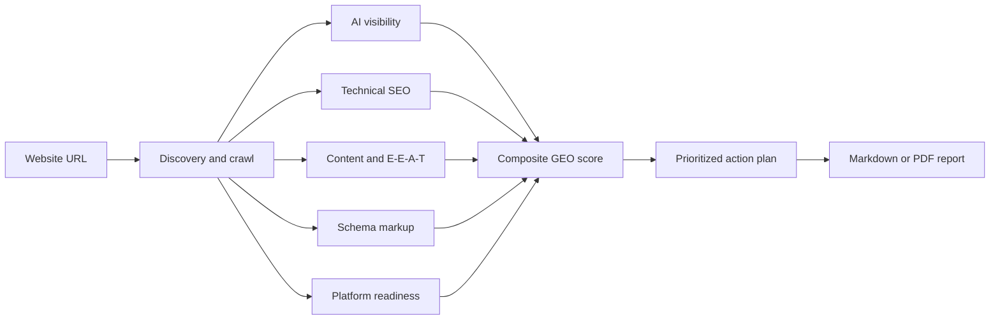

# geo-seo-codex

<p align="center">
  <strong>A Codex-ready GEO and SEO toolkit for AI-search visibility.</strong><br>
  Audit websites, improve citability, validate technical SEO and schema, and generate client-ready reports.
</p>

<p align="center">
  <a href="https://github.com/banbbo980-tech/geo-seo-codex"></a>
  
  
  <a href="LICENSE"></a>
</p>

This is the independently maintained Codex edition owned by **[banbbo980-tech](https://github.com/banbbo980-tech)**. It is a normal GitHub repository—not a GitHub fork—and includes a Windows-tested Codex integration, global skills, custom agents, an isolated Python environment, verification tools, and safe source-update automation.

## What it does

| Area | Capabilities |
|---|---|
| GEO visibility | AI citability, brand mentions, AI crawler access, `llms.txt`, and platform readiness |
| Technical SEO | Crawlability, indexability, metadata, rendering, security, mobile, and performance checks |
| Content quality | E-E-A-T, readability, freshness, answer quality, and citation-ready passages |
| Structured data | Schema.org detection, validation, recommendations, and JSON-LD templates |
| Reporting | Markdown reports, PDF reports, charts, prioritized findings, and action plans |
| Client workflow | Prospect tracking, proposals, audit comparisons, and monthly progress reports |

## How a full audit works



The composite score uses these categories:

| Category | Weight |
|---|---:|
| AI Citability and Visibility | 25% |
| Brand Authority Signals | 20% |
| Content Quality and E-E-A-T | 20% |
| Technical Foundations | 15% |
| Structured Data | 10% |
| Platform Optimization | 10% |

## Requirements

The Codex integration is currently tested on Windows 10/11.

- [Codex](https://developers.openai.com/codex/) desktop app or CLI
- [Git for Windows](https://git-scm.com/download/win), including Git Bash
- Python 3.8 or newer
- Google Chrome
- Windows PowerShell 5.1 or PowerShell 7
- Internet access during initial dependency installation

The installer creates an isolated Python environment, so it does not install packages into your system Python. Pandoc and Playwright Chromium are installed or verified for PDF reports and browser-based checks.

## Download

### Option 1: Clone with Git

Open PowerShell and run:

```powershell
git clone https://github.com/banbbo980-tech/geo-seo-codex.git
cd geo-seo-codex
```

### Option 2: Download a ZIP

[Download the latest `main` branch as a ZIP](https://github.com/banbbo980-tech/geo-seo-codex/archive/refs/heads/main.zip), extract it, and open PowerShell in the extracted folder.

Git clone is recommended because it supports the included update workflow.

## Install on Windows

Run these commands from the repository root.

### 1. Install the toolkit files

```powershell
& "C:\Program Files\Git\bin\bash.exe" ./install-win.sh
```

### 2. Install the Codex integration

```powershell
powershell -NoProfile -ExecutionPolicy Bypass -File .\codex-adapter\install-codex.ps1
```

The installer configures:

- 16 global Codex skills under `%USERPROFILE%\.agents\skills`
- 5 custom Codex agents under `%USERPROFILE%\.codex\agents`
- Global compatibility instructions at `%USERPROFILE%\.codex\AGENTS.md`
- An isolated Python environment at `%USERPROFILE%\.claude\skills\geo\.venv`
- Python dependencies, Playwright Chromium, and Pandoc support

Restart Codex after the first installation so it discovers all newly installed skills and agents.

## Verify the installation

```powershell
powershell -NoProfile -ExecutionPolicy Bypass -File .\codex-adapter\verify-install.ps1
powershell -NoProfile -ExecutionPolicy Bypass -File .\codex-adapter\verify-integrity.ps1
```

A successful verification reports 16 skills, 5 agents, 14 passing tests, and the detected Python, browser, Pandoc, schema, and template components.

## Use it in Codex

Open any Codex task and invoke the main skill with `$geo`.

```text
$geo quick https://example.com
```

Common commands:

| Codex prompt | Result |
|---|---|
| `$geo quick https://example.com` | Fast GEO visibility snapshot |
| `$geo audit https://example.com` | Full GEO and SEO audit using specialist agents |
| `$geo citability https://example.com` | AI citation-readiness analysis |
| `$geo crawlers https://example.com` | AI crawler, robots.txt, meta-tag, and header checks |
| `$geo llmstxt https://example.com` | Analyze or generate an `llms.txt` file |
| `$geo brands https://example.com` | Brand-authority and mention scan |
| `$geo platforms https://example.com` | Platform-specific AI-search recommendations |
| `$geo schema https://example.com` | Structured-data audit and generation |
| `$geo technical https://example.com` | Technical SEO audit |
| `$geo content https://example.com` | Content quality and E-E-A-T assessment |
| `$geo report https://example.com` | Client-ready Markdown report |
| `$geo report-pdf` | Professional PDF with charts and visualizations |
| `$geo prospect` | Manage the prospect and client pipeline |
| `$geo proposal` | Generate a service proposal from audit findings |
| `$geo compare` | Compare audits and create a progress report |

You can also call a specialist directly:

```text
$geo-citability analyze https://example.com
$geo-schema audit https://example.com
$geo-technical audit https://example.com
```

## Installed skills

`geo`, `geo-audit`, `geo-brand-mentions`, `geo-citability`, `geo-compare`, `geo-content`, `geo-crawlers`, `geo-llmstxt`, `geo-platform-optimizer`, `geo-proposal`, `geo-prospect`, `geo-report`, `geo-report-pdf`, `geo-schema`, `geo-technical`, and `geo-update`.

## Installed agents

- `geo-ai-visibility`
- `geo-content`
- `geo-platform-analysis`
- `geo-schema`
- `geo-technical`

The agents divide a full audit into focused analyses and feed their findings back into the final report.

## Reports and local data

Generated prospect and reporting data is stored outside the repository:

```text
%USERPROFILE%\.geo-prospects\
├── prospects.json
├── proposals\
└── reports\
```

PDF reports use the included HTML/CSS templates, Pandoc, and Chrome to render score gauges, comparison tables, severity colors, and action-plan charts.

## Check for updates

Check whether the source toolkit has new commits without changing your files:

```powershell
.\codex-adapter\check-upstream.ps1
```

Review the reported commits and changed files. To safely synchronize, reinstall, verify, commit, and push the update:

```powershell
.\codex-adapter\sync-upstream.ps1
```

The sync script aborts instead of guessing if it encounters a merge conflict. The `upstream-main` branch preserves the exact source history, while `main` contains this repository's Codex integration and documentation.

## Project layout

```text
geo-seo-codex/
├── geo/                 Main GEO skill
├── skills/              15 specialist skills
├── agents/              5 specialist agent prompts
├── scripts/             Python analysis utilities
├── schema/              JSON-LD templates
├── templates/           Report templates and styling
├── tests/               Automated tests
├── codex-adapter/       Codex installation, verification, and sync tools
└── .github/workflows/   Automated source-update monitoring
```

## Troubleshooting

### Codex does not recognize `$geo`

Restart Codex, then run the installer and verifier again:

```powershell
powershell -NoProfile -ExecutionPolicy Bypass -File .\codex-adapter\install-codex.ps1
powershell -NoProfile -ExecutionPolicy Bypass -File .\codex-adapter\verify-install.ps1
```

### Git Bash is not found

Install Git for Windows in its default location, then reopen PowerShell. The expected executable is `C:\Program Files\Git\bin\bash.exe`.

### PDF generation fails

Confirm that Google Chrome and Pandoc are installed, then rerun `verify-install.ps1`. The installer normally installs Pandoc through `winget` and downloads Playwright Chromium automatically.

### PowerShell blocks a script

Use the documented `powershell -NoProfile -ExecutionPolicy Bypass -File ...` command. It changes execution policy only for that process.

## Repository ownership and license

This independently maintained Codex edition, its integration scripts, and its documentation are maintained by **banbbo980-tech**. The repository also incorporates MIT-licensed source work and preserves the copyright and permission notice required by the [MIT License](LICENSE). Existing contributor history remains visible and is not rewritten.

You may use, modify, and redistribute the software under the terms of that license.

---

Maintained for practical GEO, SEO, AI-search auditing, and client reporting with Codex.
